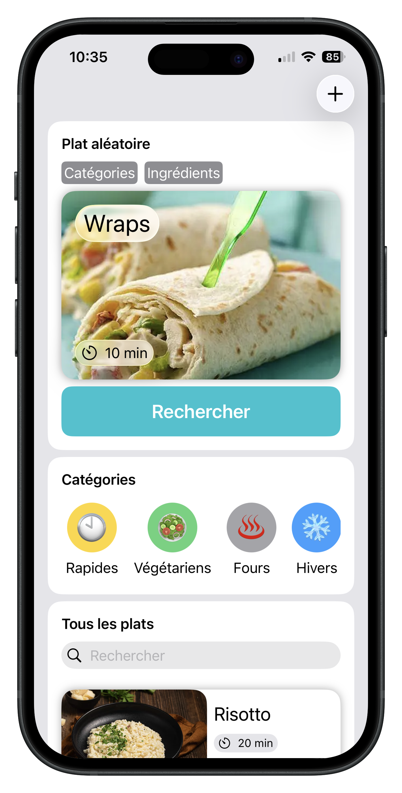
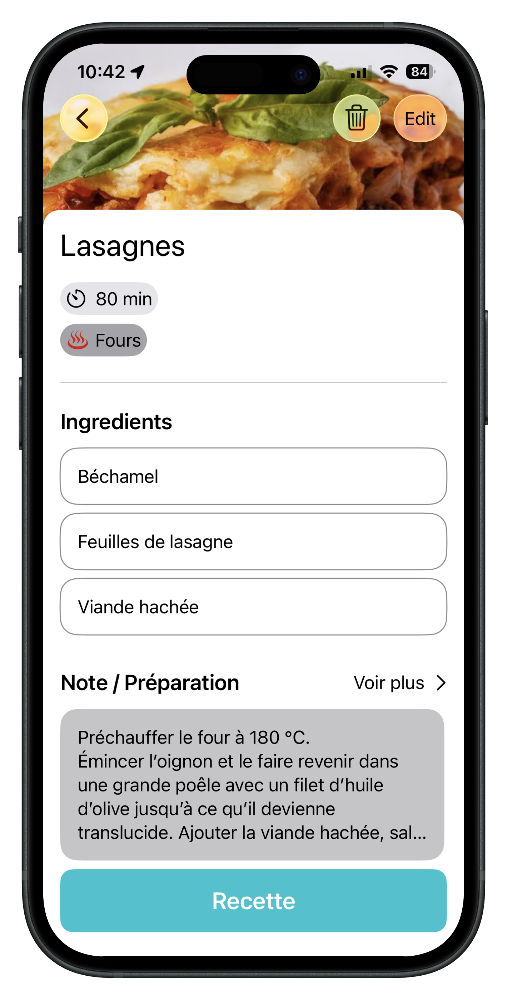
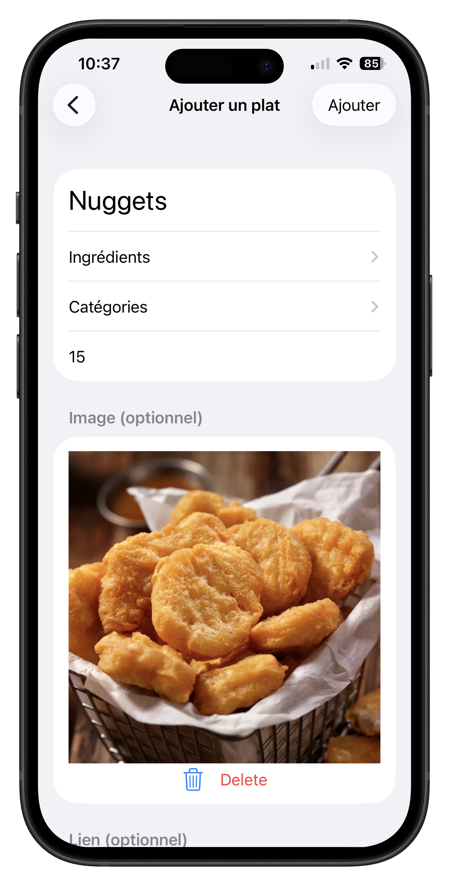

# 🍽️ What'sForDinner

What'sForDinner est une application iOS développée en SwiftUI permettant de gérer, filtrer et découvrir des idées de repas facilement.

Elle permet d’ajouter ses plats favoris, de les catégoriser, d’associer des ingrédients et de sélectionner un plat aléatoire selon des critères personnalisés.

---

## 📱 Fonctionnalités

- ✅ Ajout, modification et suppression de plats
- 🗂️ Gestion des catégories personnalisées
- 🥕 Gestion des ingrédients
- 🔎 Recherche de plats par nom
- 🎲 Sélection d’un plat aléatoire selon :
  - Catégories sélectionnées
  - Ingrédients sélectionnés
- 💾 Persistance locale avec CoreData

---

## 🏗️ Architecture

L’application suit une architecture MVVM avec séparation des responsabilités :

- **Views** → Interface utilisateur SwiftUI
- **ViewModels** → Logique métier et gestion d’état
- **Repositories** → Abstraction de CoreData
- **CoreData** → Persistance locale

---

## 🛠️ Stack technique

- Swift
- SwiftUI
- CoreData
- MVVM
- Repository Pattern

---

## 🎯 Objectifs du projet

Ce projet a été réalisé pour :

- Approfondir SwiftUI
- Mieux structurer une application CoreData
- Mettre en place une architecture propre et évolutive

---

## 🚀 Améliorations

- Mode sombre optimisé
- Animations plus poussées
- Synchronisation Cloud
- Tests unitaires
- Refactor de certaines logiques métier
- Meilleur design

---

## 📸 Aperçu

 

